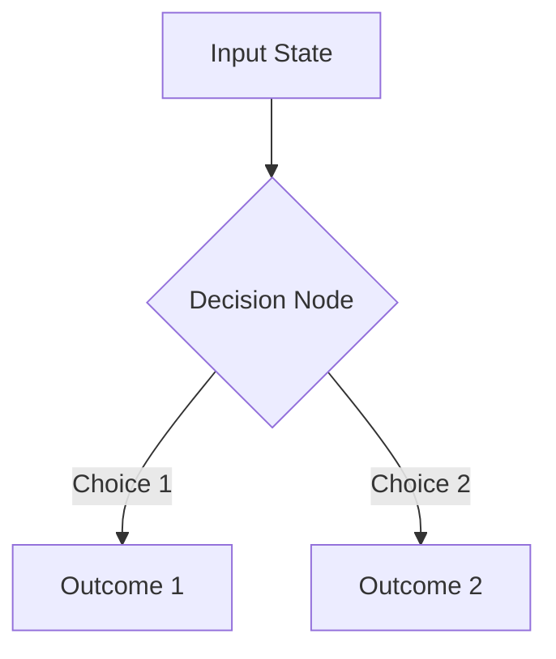

## Overview & Purpose

Visual Reasoning uses structured visual diagrams (Mermaid flowcharts, sequence diagrams, architecture blueprints) to model spatial relationships, execution flows, and system components visually.

## When to Use

- **Architecture Documentation**: Drawing flowcharts, sequence diagrams, or component diagrams.
- **Workflow Visualization**: Clarifying complex state machines or process branches.

## Execution Workflow

1. **Select Diagram Type**: Choose Mermaid diagram style (flowchart, sequenceDiagram, classDiagram, graph TD).
2. **Model Nodes & Relationships**: Map entities to nodes and connections to labeled arrows.
3. **Render Diagram Block**: Output syntactically valid Mermaid code blocks.

## Expected Output Contract

## Scripts

- `scripts/visual_reasoning.py` - Deterministic evaluation, state validation, and CLI tool for visual-reasoning.

